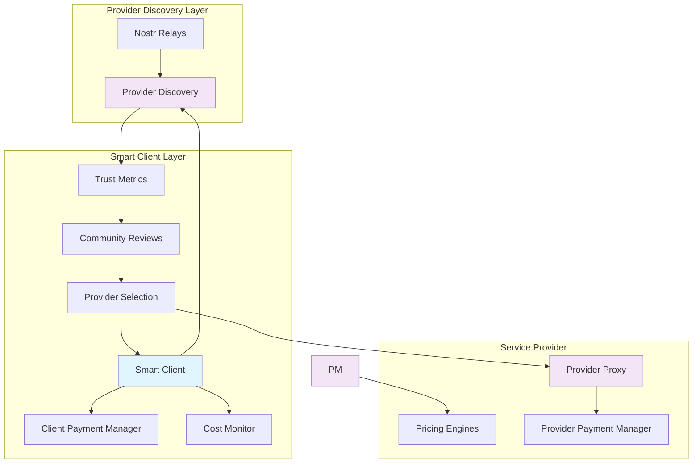

# Smart Client and Dynamic Server Architecture

## Overview

The Smart Client and Provider specification introduces an intelligent, adaptive system where clients efficiently interact with servers that dynamically adjust parameters like cost per request to optimize operations. This architecture emphasizes server-driven pricing, seamless payment handling, and real-time adaptability.

## Core Concept

The Smart Client and Provider/Server architecture creates an intelligent ecosystem where clients efficiently discover and interact with LLM service providers through a combination of decentralized provider discovery (via Nostr) and direct service connections with dynamic pricing optimization.

## Architecture Components

### Smart Client Features

The smart client orchestrates the entire service discovery and consumption process:

- **Decentralized Provider Discovery**: Leverages Nostr network to discover and evaluate LLM service providers
- **Intelligent Provider Selection**: Automatically filters providers based on trust scores, pricing, capabilities, and user preferences
- **Dynamic Payment Processing**: Supports eCash transactions with automatic change handling and account-based payments
- **Real-time Cost Monitoring**: Tracks pricing updates from multiple providers and optimizes cost-effectiveness

### Provider Capabilities

Service providers adapt and compete in real-time:

- **Dynamic Pricing**: Adjusts costs based on demand, resources, and market conditions to optimize profitability
- **Model Management**: Offers diverse model portfolios with varying capabilities and pricing tiers
- **Payment Processing**: Handles eCash transactions with instant settlements and account management
- **Community Engagement**: Builds reputation through consistent service delivery and user satisfaction

### Nostr-Based Trust Infrastructure

The trust layer enables decentralized provider evaluation:

- **Provider Announcements**: Service providers publish discovery event on Nostr relays
- **Community Validation**: Users share experiences and build provider reputation through social proof
- **Trust Metrics**: Combines follower counts, user reviews, and own followed provider list
- **Reputation Building**: Providers establish credibility through consistent service and community engagement

### eCash Payment System

The payment infrastructure ensures efficient, low-latency transactions:

- **Instant Transactions**: eCash enables immediate payment processing with privacy preservation
- **Change Handling**: Automatic generation and return of excess payments through eCash tokens
- **Account Integration**: Pre-funded accounts for seamless recurring usage and subscription models
- **Cost Optimization**: Dynamic payment adjustments based on real-time provider pricing

## Detailed Documentation by Theme

This documentation is organized into comprehensive guides covering each major theme of the architecture:

### 📊 [Cost Management System](./cost-management.md)

Comprehensive guide to server-based pricing, and cost optimization strategies:

### 💳 [Payment Handling Mechanisms](./payment-handling.md)

Complete coverage of payment methods, transaction flows, and security features:

### 🔄 [Client-Server Interaction Patterns](./client-server-interaction.md)

Detailed explanation of intelligent communication patterns and decision-making processes:

### ⚡ [Dynamic Pricing Adjustment](./dynamic-pricing-adjustment.md)

In-depth coverage of sophisticated pricing algorithms and market responsiveness:

### 🌐 [Nostr Integration & Provider Discovery](./nostr-integration-provider-discovery.md)

Comprehensive exploration of decentralized provider discovery and trust systems:

## System Benefits

### For Service Providers

- **Revenue Optimization**: Dynamic pricing maximizes revenue while maintaining competitive positioning
- **Resource Efficiency**: Intelligent load distribution and capacity optimization
- **Market Responsiveness**: Real-time adaptation to changing market conditions
- **Community Building**: Reputation-based provider ecosystem with transparent metrics

### For Smart Clients

- **Cost Optimization**: Intelligent provider selection and cost-effective decision making
- **Payment Flexibility**: Multiple payment methods with automatic change handling
- **Trust-Based Selection**: Community-driven provider evaluation and reputation systems
- **Seamless Experience**: Automated processes with minimal user intervention

### For the Ecosystem

- **Decentralization**: No single point of failure or central authority control
- **Innovation**: Lower barriers to entry encourage diverse providers and new technologies
- **Transparency**: Open reputation systems and community-driven quality assurance
- **Scalability**: Distributed architecture supports global growth and adoption

## Getting Started

To understand the complete system:

- **[Cost Management](./cost-management.md)** to understand the economic foundation
- **[Client-Server Interaction](./client-server-interaction.md)** for communication patterns
- **[Dynamic Pricing](./dynamic-pricing-adjustment.md)** for advanced pricing strategies
- **[Nostr Integration](./nostr-integration-provider-discovery.md)** for decentralized discovery

## Future Developments

This architecture represents a significant advancement in intelligent, adaptive systems that optimize both user experience and operational efficiency while maintaining security, transparency, and innovation capabilities. The modular design allows for continuous evolution and improvement of individual components while maintaining system coherence.

The combination of smart clients, dynamic servers, and decentralized discovery creates a robust foundation for the next generation of AI service delivery platforms.
