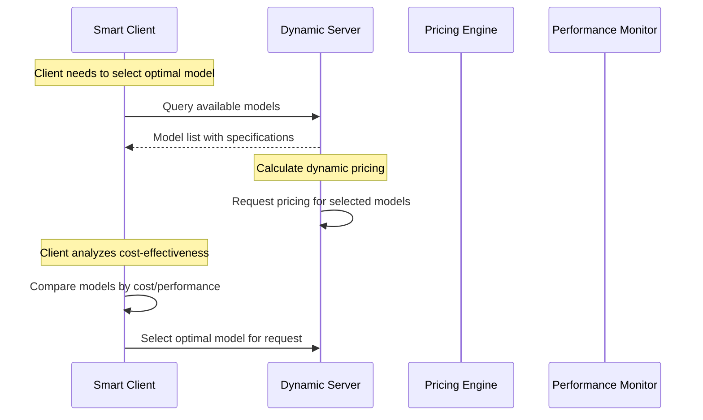
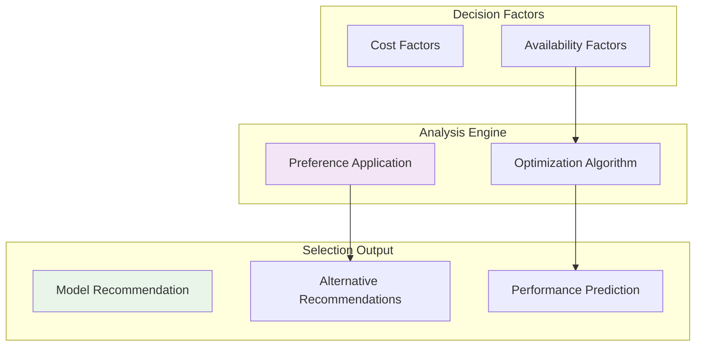
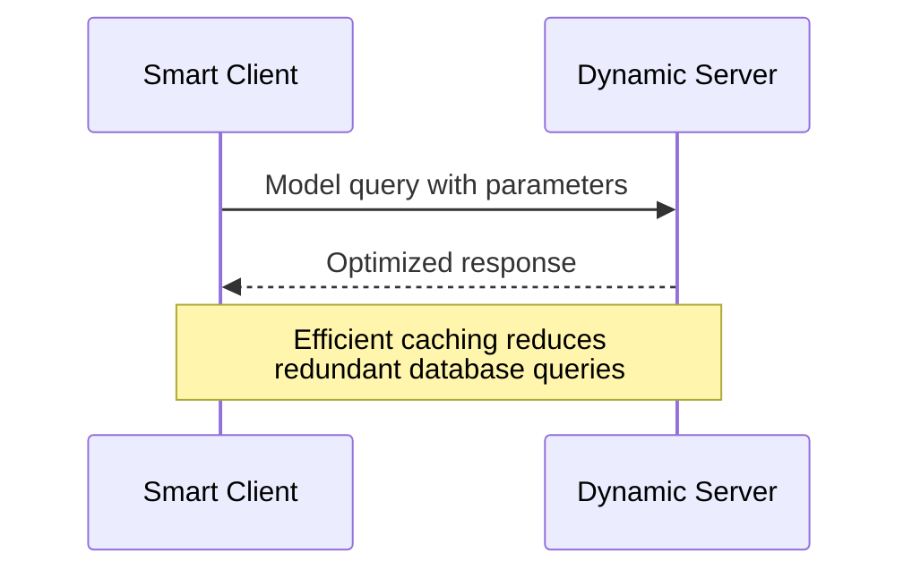

# Client-Server Interaction Patterns

## Overview

The client-server interaction system enables intelligent decision-making through comprehensive model and pricing queries, allowing clients to make cost-effective choices based on real-time server data while maintaining efficient communication patterns.

## Model Discovery and Selection Flow

### Three-Stage Selection Process

**1. Model Discovery**

- Query server for available models with detailed specifications
- Receive capabilities, context lengths, model types

**2. Pricing Analysis**

- Request current costs per million tokens
- Request pricing updates
- Compare costs across different model options and providers

**3. Selection Optimization**

- Analyze cost-effectiveness based on specific use case requirements
- Integrate quality metrics and performance ratings
- Balance cost optimization with performance standards

## Client Intelligence Architecture

### Smart Decision Features

**Multi-factor Analysis**: Balances cost, performance, quality, and availability

**Request Optimization**:

- **Timing Optimization**: Schedules requests during lower-cost periods
- **Model Switching**: Dynamically selects based on current conditions
- **Load Distribution**: Spreads requests across multiple providers

**Performance Monitoring**:

- Real-time cost tracking and budget management
- Success rate monitoring with retry logic

## Server Capabilities

### Dynamic Model Management

- **Real-time Updates**: Continuous model catalog and capability updates
- **Resource Allocation**: Dynamic computational resource distribution
- **Load Balancing**: Intelligent request distribution and queue optimization
- **Failover Handling**: Automatic handling of model or resource failures

### Intelligent Recommendations

- **Performance Optimization**: Recommending models for specific use cases
- **Cost Optimization**: Suggesting cost-effective alternatives

## Communication Protocols

### Efficient Data Exchange

### Protocol Optimizations

- **Response Caching**: Intelligent caching of frequently requested data
- **Streaming Updates**: Real-time pricing, availability, and performance data
- **Batch Requests**: Support for batched queries to reduce overhead

## System Benefits

### For Smart Clients

- **Informed Decision Making**: Access to comprehensive data for optimal choices
- **Cost Optimization**: Tools for minimizing costs while meeting requirements
- **Automated Selection**: Intelligent automation for routine decisions

### For Dynamic Servers

- **Revenue Maximization**: Optimal pricing strategies based on demand patterns
- **Quality Assurance**: Continuous monitoring and service improvement
- **Scalability**: Efficient handling of diverse client requests and preferences

---

_This interaction pattern ensures optimal resource utilization and intelligent decision-making through streamlined communication protocols and automated selection processes._
