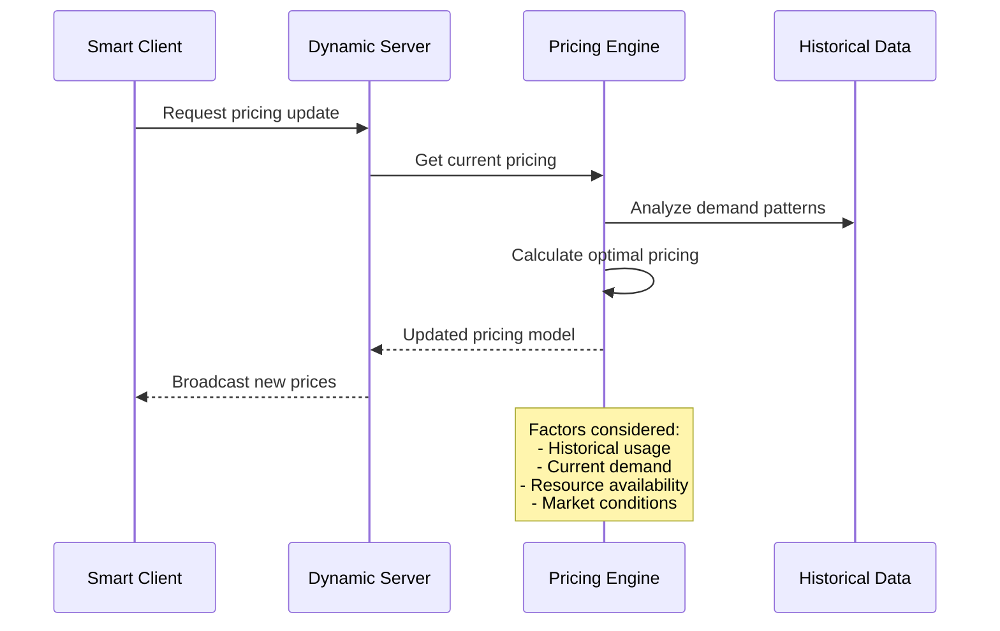
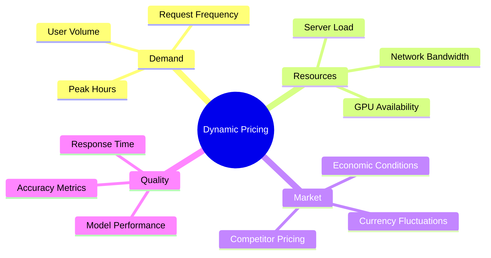

# Cost Management System

## Overview

The cost management system places full responsibility for pricing calculations on the server side, enabling intelligent, data-driven pricing decisions that optimize both resource utilization and profitability.

## Server-Based Pricing Architecture

### Core Pricing Responsibilities

1. **Historical Data Analysis**: Processes usage patterns and demand trends to identify optimal pricing windows
2. **Real-time Adjustment**: Modifies prices based on current server load and resource availability
3. **Resource Optimization**: Balances cost with available computational resources to maximize efficiency
4. **Transparency**: Provides all pricing changes to connected clients when requested

## Dynamic Pricing Factors

## Cost Optimization System

### Real-Time Monitoring

- **Live Updates**: Continuous streaming of current pricing information
- **Cost Prediction**: Forward-looking estimates for planned requests
- **Effectiveness Analysis**: Automated provider comparison based on cost and quality

## System Benefits

### For Service Providers

- **Revenue Optimization**: Maximizes revenue while maintaining competitive positioning
- **Market Responsiveness**: Adapts quickly to changing conditions and demand patterns

### For Clients

- **Cost Transparency**: Clear visibility into pricing factors and changes
- **Informed Decisions**: Real-time pricing data for optimal provider selection
- **Value Optimization**: Balance cost with performance requirements

## Payment System Integration

Seamless integration with various payment mechanisms:

- **Dynamic Calculation**: Real-time cost calculation during payment processing
- **Overpayment Handling**: Automatic refund processing when payments exceed costs
- **Account Management**: Intelligent deduction from pre-funded account balances
- **Multi-Currency Support**: Handling various payment methods with dynamic conversion

---

_This cost management approach ensures optimal resource utilization while providing transparency and flexibility for both service providers and clients in the dynamic LLM service ecosystem._
Cost Management System
