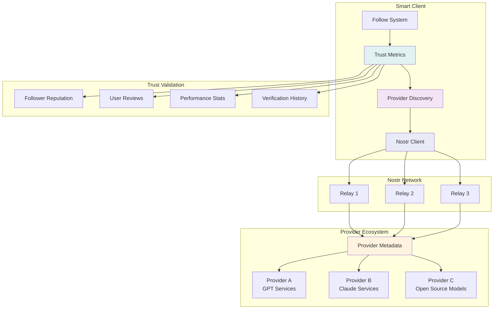
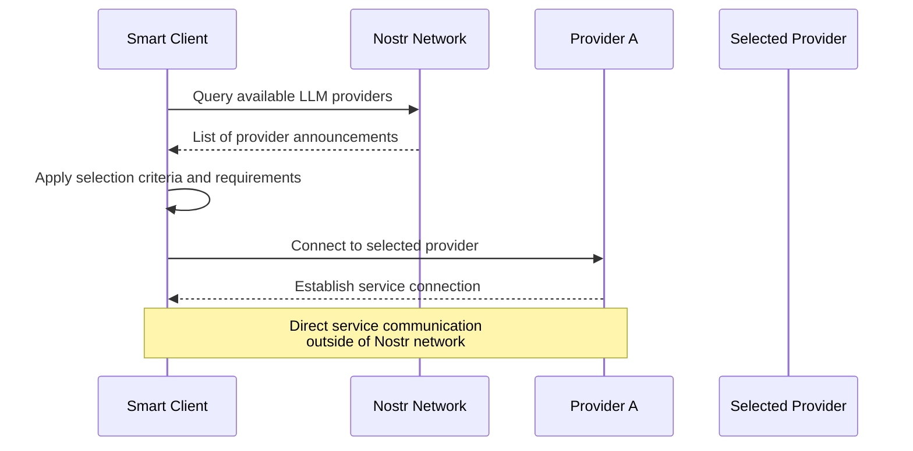
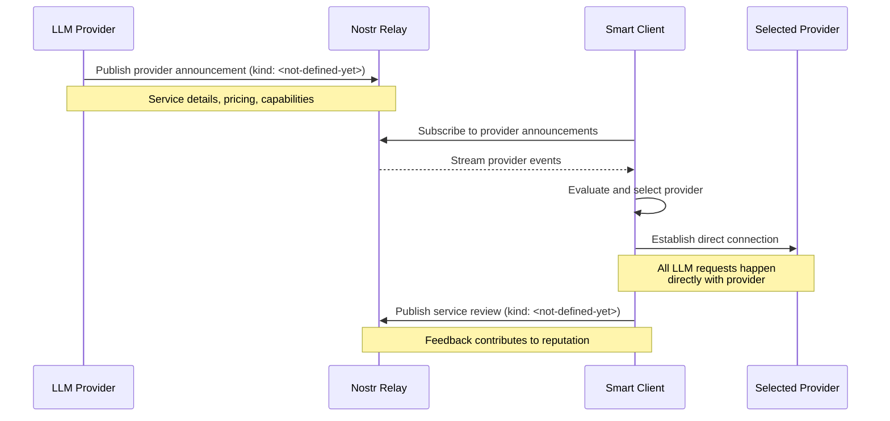
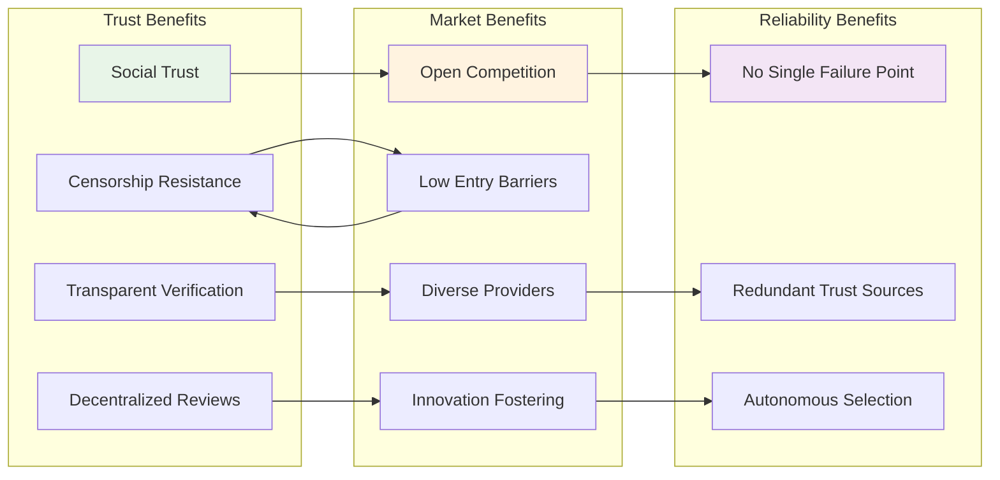
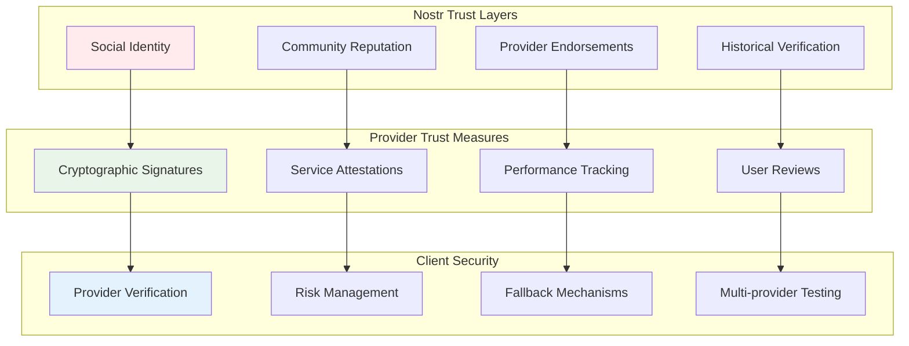

# Nostr Integration and Provider Discovery

## Overview

Nostr serves as a decentralized provider discovery mechanism, enabling clients to find and evaluate LLM service providers based on trust metrics and community reputation. This approach creates a decentralized marketplace for AI services while maintaining direct client-provider relationships for actual service delivery.

## Discovery Architecture

## Provider Discovery Process

### Core Discovery Flow

1. **Provider Announcement**: LLM providers publish cryptographically signed service metadata on Nostr relays (including endpoints)
2. **Trust Evaluation**: Clients evaluate providers using multi-dimensional trust scoring, follower count, user reviews
3. **Community Validation**: Social proof through follower networks, collaborative filtering, and reputation propagation through community connections
4. **Reputation Building**: Providers build reputation through consistent service delivery, transparent performance metrics, and community engagement

### Selection Workflow

## Trust Framework

### Trust Indicators

**Social Metrics**: Follower count and growth patterns, trusted contact follows, community endorsements from respected members (maybe a bad idea), network effect validation

**Performance Metrics**: user satisfaction with LLM outputs

**Security Verification**: verification using Nostr keys, service claim validation, independent testing, public audit trails

### Event Flow System

## Decentralized Marketplace Benefits

### System Architecture Advantages

### Market Dynamics

**Open Access**: No central authority control, permission-less entry for providers, global accessibility, censorship resistance

**Quality Assurance**: User reviews create quality pressure, reputation-based selection, community feedback drives improvement, transparent performance metrics

**Innovation Catalyst**: Lower barriers for new providers, diverse model offerings, experimental technology support, rapid adoption of innovations

**Ecosystem Growth**: Smaller providers can compete, community-driven development, geographic diversity, specialized service providers

## Security and Trust Model

### Multi-layered Security

### Security Features

**Trust Verification**: Social proof through follower networks, community-validated performance history

**Risk Mitigation**: Multiple provider options, geographic diversity, community warning systems, gradual trust building through small transactions

**Accountability**: Public record of provider behavior, open review systems, immutable reputation history, tamper-proof trust metrics

## Implementation Benefits

### For Providers

- **Market Access**: Open, permissionless entry to global market
- **Reputation Building**: Transparent, community-driven reputation system
- **Innovation Support**: Lower barriers for experimental technologies and specialized services

### For Clients

- **Provider Choice**: Access to diverse, specialized, and experimental providers
- **Trust Assurance**: Multi-dimensional trust metrics and community validation
- **Cost Benefits**: Open competition and transparent pricing

### For Ecosystem

- **Decentralization**: No single points of failure or central control
- **Innovation**: Rapid adoption of new technologies and business models
- **Quality**: Community-driven quality assurance and continuous improvement

---

_This model positions Nostr as critical infrastructure for AI service discovery while maintaining direct client-provider relationships, creating a trustworthy, decentralized marketplace that promotes innovation and accessibility._
