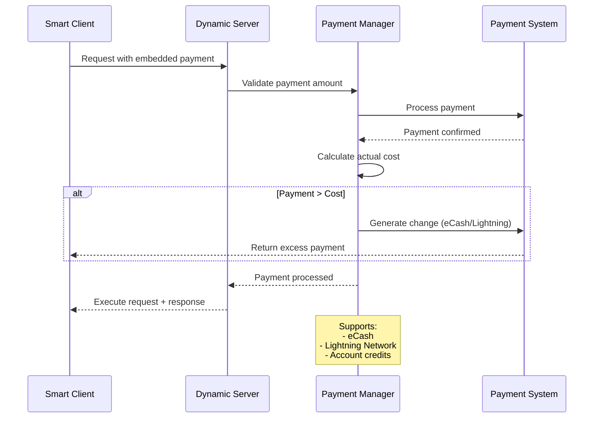
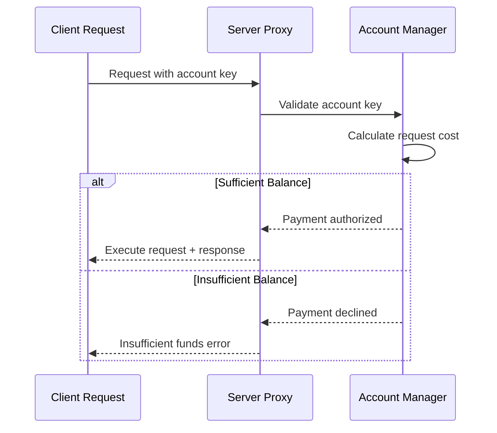
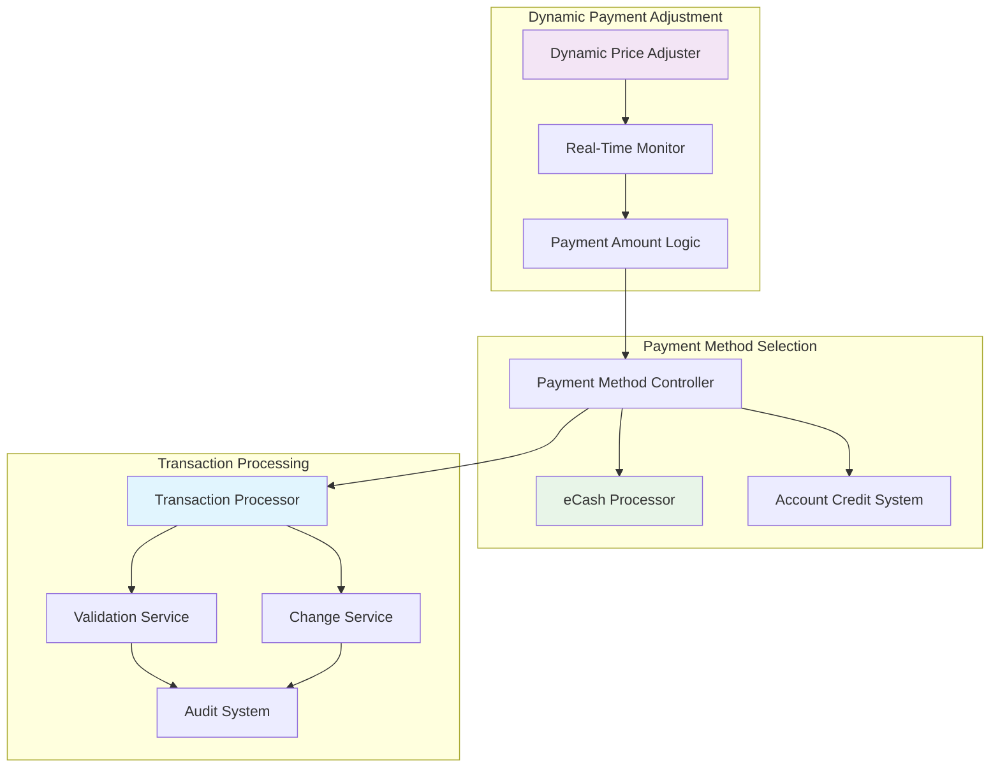
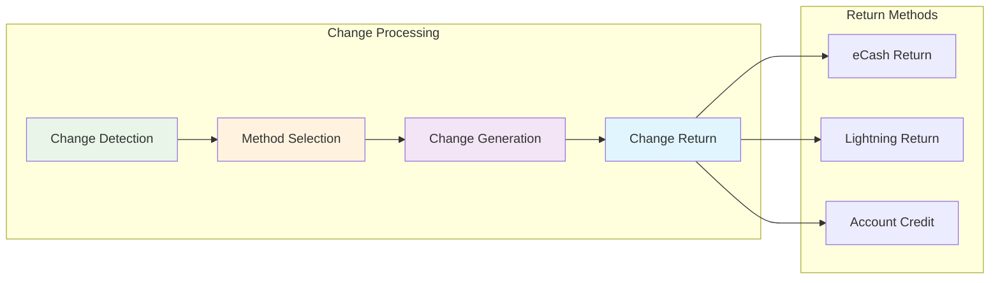

# Payment Handling Mechanisms

## Overview

The payment handling system supports multiple payment methods with intelligent processing, automatic change handling, and seamless integration with dynamic pricing. The system emphasizes low-latency transactions while maintaining security and flexibility.

## Payment Methods

### eCash Payment System

The payment infrastructure ensures efficient, low-latency transactions:

- **Instant Transactions**: eCash enables immediate payment processing with privacy preservation
- **Change Handling**: Automatic generation and return of excess payments through eCash tokens
- **Account Integration**: Pre-funded accounts for seamless recurring usage and subscription models
- **Cost Optimization**: Dynamic payment adjustments based on real-time provider pricing

### Multi-Payment Support

The system supports various payment mechanisms:

- **eCash**: Instant, private transactions
- **Account Credits**: Pre-funded balances for seamless recurring usage

## Payment Flow Patterns

### Payment with Request Flow

**Key Features:**

1. **Embedded Payment**: Payments are included directly with service requests
2. **Real-time Validation**: Immediate verification of payment authenticity and sufficiency
3. **Automatic Change**: Excess payments are automatically returned as change
4. **Multi-Method Support**: Flexible payment processing across different systems

### Account-Based Payment Flow

**Account System Benefits:**

- **Seamless Experience**: No need to handle payments for each individual request
- **Pre-funded Convenience**: Users can load funds once and use services multiple times
- **Instant Processing**: Account-based transactions have minimal latency
- **Balance Management**: Real-time tracking of account balances and usage

## Smart Payment Processing

The payment system leverages ecash technologies for efficient, low-latency transactions with dynamic adjustment capabilities.

## Smart Payment Features

### 1. Multi-Method Support

- **eCash**: Instant, private transactions with offline capability
- **Account Credits**: Pre-funded balances for seamless recurring usage

### 2. Dynamic Adjustment Mechanisms

- **Real-time Price Monitoring**: Continuous tracking of pricing changes during payment processing
- **Automatic Amount Calculation**: Dynamic adjustment of payment amounts based on current server pricing
- **Overpayment Handling**: Intelligent change generation and return via preferred payment method

### 3. Low-Latency Processing

- **Pre-validation**: Payment method verification before request processing
- **Parallel Processing**: Simultaneous payment validation and request preparation
- **Instant Settlement**: Immediate confirmation for supported payment methods

## Change Handling System

### Automatic Change Generation

When payments exceed the actual service cost:

1. **Cost Calculation**: Real-time calculation of actual service cost
2. **Excess Detection**: Automatic identification of overpayment amounts
3. **Change Generation**: Creation of appropriate change tokens/credits
4. **Return Processing**: Delivery of change to client via preferred method

### Change Method Selection

**Change Return Strategies:**

- **Same Method Return**: Return change using the same payment method when possible
- **Optimal Method Selection**: Choose the most efficient return method based on amount and fees
- **Account Credit Option**: Convert small change amounts to account credits for future use
- **Aggregated Returns**: Combine multiple small change amounts for efficient processing

## Security Features

- **Privacy Preservation**: Payment methods that protect user financial privacy
- **Atomic Transactions**: Ensuring payment and service delivery happen together or not at all
- **Fraud Detection**: Automated systems for identifying suspicious payment patterns

## Integration Benefits

### For Service Providers

- **Instant Settlement**: Immediate payment confirmation and fund availability
- **Reduced Risk**: Automatic validation reduces payment-related risks
- **Multiple Revenue Streams**: Support for various payment methods expands customer base
- **Automated Processing**: Minimal manual intervention required for payment handling

### For Clients

- **Payment Flexibility**: Choice of payment methods based on preferences and circumstances
- **Transparent Pricing**: Clear visibility into costs and automatic change handling
- **Privacy Options**: Payment methods that preserve financial privacy when desired

---

_This payment handling system provides a robust, flexible foundation for financial transactions in the dynamic LLM service ecosystem, ensuring both security and user experience optimization._
